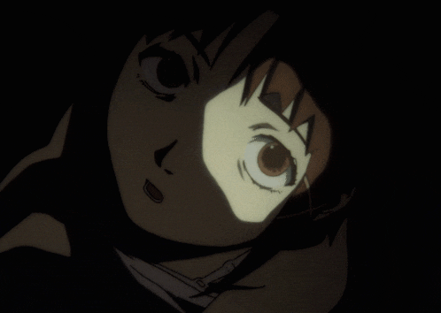
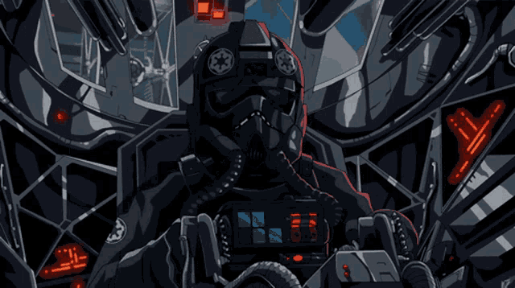

# Добро пожаловать в мой мир
> "Все подключены... и это то, что я выбрал."

## О себе
Привет! Я разработчик, работающий на языках **C** и **Python**. Имею опыт работы с **aiogram** и **ollama**. 

  

## Технологии и навыки
- **Языки**: C, Python
- **Навыки**: Reverse engineering, osint
- **ОС**: Arch Linux

  

<!--
**FeliGcc/FeliGcc** is a ✨ _special_ ✨ repository because its `README.md` (this file) appears on your GitHub profile.

Here are some ideas to get you started:

- 🔭 I’m currently working on ...
- 🌱 I’m currently learning ...
- 👯 I’m looking to collaborate on ...
- 🤔 I’m looking for help with ...
- 💬 Ask me about ...
- 📫 How to reach me: ...
- 😄 Pronouns: ...
- ⚡ Fun fact: ...
-->
